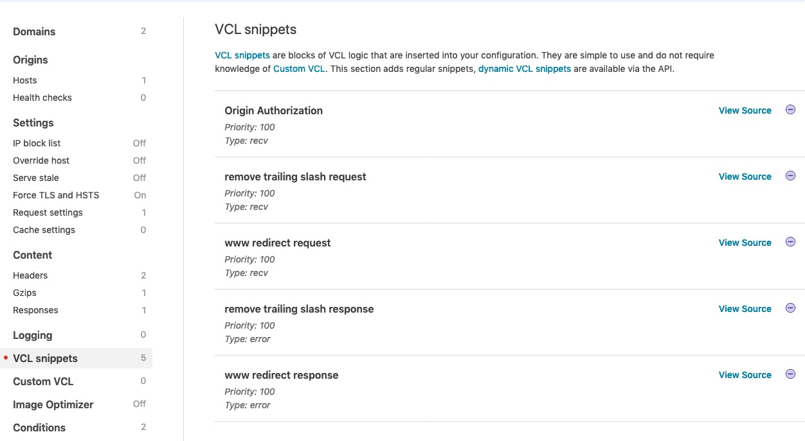

If you have a CDN in front of your origin server then you likely block direct public access to your origin server with an authorization challenge.

Some reasons why you'd block public access:

- Rate limiting. If bots can spam your server, they can likely take it down. CDNs have measures to automatically rate limit, or at least serve cached versions of your pages without requesting them from your origin.
- SEO. You only want your pages crawled on one host, and that host will likely point to your CDN. Without an authorization challenge it is possible for googlebot to crawl the host of your origin.

## Setting the Authorization Header with Fastly

[Fastly](https://www.fastly.com/) is one of the easiest CDNs to use, but setting custom headers isn't as clear as it should be.

You need to create a custom [VCL](https://docs.fastly.com/en/guides/guide-to-vcl) snippet to set the header.



Add this code snippet:

```
set req.http.Authorization = "Basic " digest.base64("your-username:your-password");
```

The [Authorization Header](https://developer.mozilla.org/en-US/docs/Web/HTTP/Headers/Authorization) is using the standard syntax: `Authorization: <type> <credentials>` where `type` is `Basic` and the `credentials` are base64 encoded.

The snippet above sets the header and encodes the raw credentials that your origin server expects.
