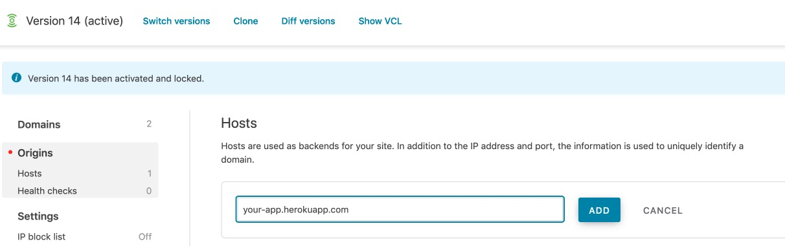
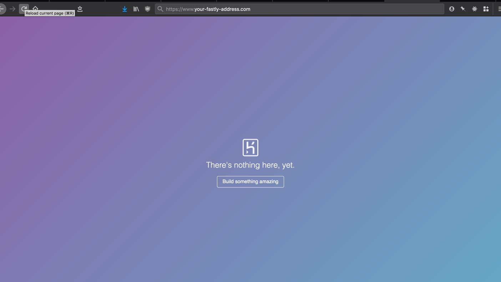
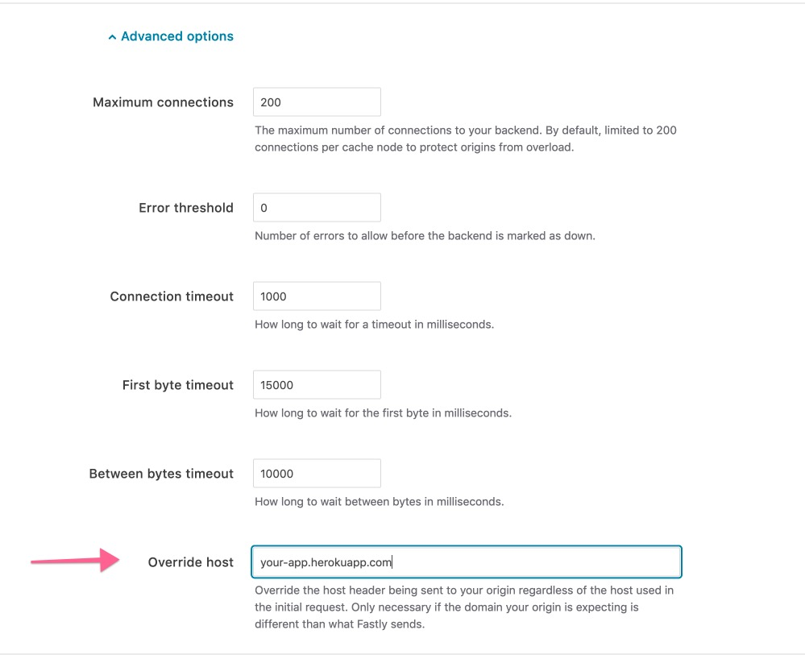

Most documentation recommends the [Fastly add-on in Heroku](https://elements.heroku.com/addons/fastly) to set up Fastly as a CDN in front of a Heroku dyno. While that solution is as simple as it gets, it comes with additional costs.

Save money by setting up Fastly to use Heroku as an origin yourself.

And it only takes 2 minutes!

## The Problem

Setting up a Fastly CDN to connect to an origin is as simple as toggling to the *Origins* pane in the left navigation bar, and adding the host for your origin.

The host for a Heroku dyno is the domain that you access the app from Heroku, usually in the form `my-app.herokuapp.com`.

If you add that host to Fastly, activate the change, and visit the test domain that Fastly sets up for you, you'll be greeted with a page like this:

That color scheme and favicon look familiar...

The page is being served from Heroku!

So we are hitting Heroku, but why isn't our app being shown?

## The Solution

In the depths of the [Fastly documentation](https://docs.fastly.com/en/guides/specifying-an-override-host) you'll find a section on overriding the host header.

> When using backends such as Amazon S3, Google Cloud Storage, or Heroku, you want to ensure you use the proper host header so these providers know how to route requests directly to your content. Each provider uses the host header to associate requests with your account's storage location.

Without overriding the host header, Fastly will send its own `Host` header to your Heroku dyno, and Heroku won't know what to do with it.

Clone your Fastly service then click on the origin that you already set up.

If you scroll to the bottom you'll see a dropdown for *Advanced Options*, and at the bottom of the advanced options you'll see a field to specify the overriding host header.

Put the same host that you configured as your origin. In our example that's `my-app.herokuapp.com`.

Open the Fastly test url and you'll see your Heroku app being served through the Fastly CDN!
