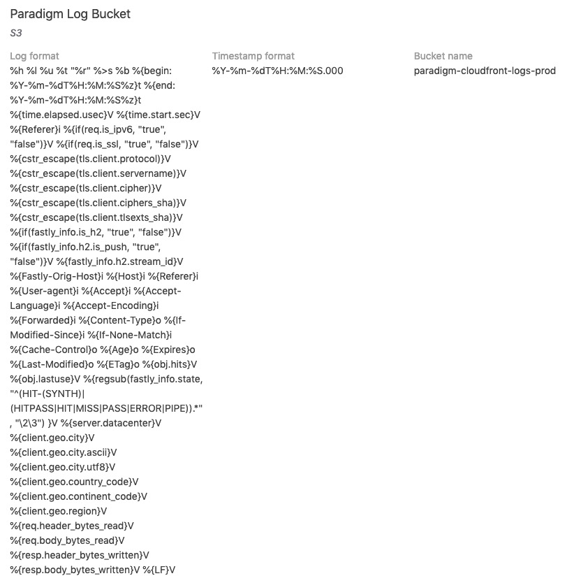

The default log data from [Fastly](https://www.fastly.com/) is light on data. You don't even get a log for the `User Agent`.

[Here are the optional variables](https://docs.fastly.com/en/guides/useful-variables-to-log#cache-related-logging-variables) you can add to your logs.

Fastly doesn't provide a way to "select all" variables. You need to type each of them manually.



I want to save you a lot of time copy/pasting. Use this snippet to configure Fastly to stream all log variables:

```
%h %l %u %t "%r" %>s %b %{begin:%Y-%m-%dT%H:%M:%S%z}t %{end:%Y-%m-%dT%H:%M:%S%z}t %{time.elapsed.usec}V %{time.start.sec}V %{Referer}i %{if(req.is_ipv6, "true", "false")}V %{if(req.is_ssl, "true", "false")}V %{cstr_escape(tls.client.protocol)}V %{cstr_escape(tls.client.servername)}V %{cstr_escape(tls.client.cipher)}V %{cstr_escape(tls.client.ciphers_sha)}V %{cstr_escape(tls.client.tlsexts_sha)}V %{if(fastly_info.is_h2, "true", "false")}V %{if(fastly_info.h2.is_push, "true", "false")}V %{fastly_info.h2.stream_id}V %{Fastly-Orig-Host}i %{Host}i %{Referer}i %{User-agent}i %{Accept}i %{Accept-Language}i %{Accept-Encoding}i %{Forwarded}i %{Content-Type}o %{If-Modified-Since}i %{If-None-Match}i %{Cache-Control}o %{Age}o %{Expires}o %{Last-Modified}o %{ETag}o %{obj.hits}V %{obj.lastuse}V %{regsub(fastly_info.state, "^(HIT-(SYNTH)|(HITPASS|HIT|MISS|PASS|ERROR|PIPE)).*", "\2\3") }V %{server.datacenter}V %{client.geo.city}V %{client.geo.city.ascii}V %{client.geo.city.utf8}V %{client.geo.country_code}V %{client.geo.continent_code}V %{client.geo.region}V %{req.header_bytes_read}V %{req.body_bytes_read}V %{resp.header_bytes_written}V %{resp.body_bytes_written}V %{LF}V
```

It ends with a newline character variable.
