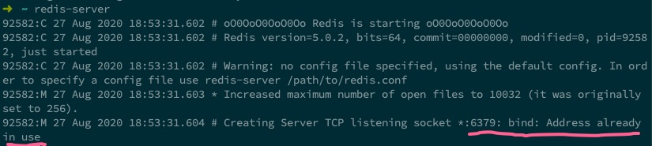

You try to start a local redis process with `redis-server` then see:

```
...
...
... *:6379: bind: Address already in use
```



## How to shut it down?

```
$ redis-cli
127.0.0.1:6379> SHUTDOWN
```

Running `redis-cli` logs you into the running redis process and allows you to do things like flush the cache (`FLUSHALL`), and shut down the running process itself (`SHUTDOWN`).
